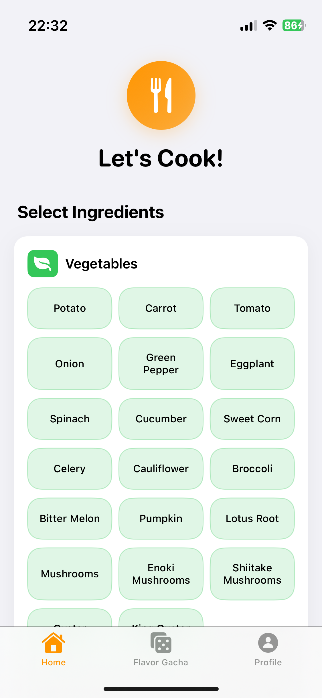
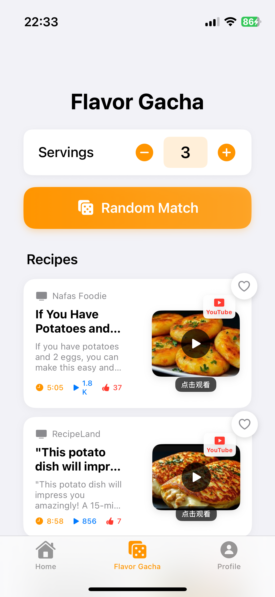
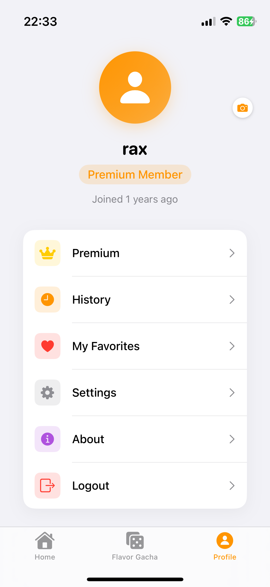

# HomeCook iOS 应用

HomeCook 是一个基于 SwiftUI 开发的 iOS 烹饪应用，支持多国语言，帮助用户选择食材和厨具来获取食谱推荐。


## 功能特性
### 🏠 主页 (Home)
- **食材选择**: 支持选择蔬菜、肉类和主食
- **厨具选择**: 选择烤箱、空气炸锅、微波炉等厨具
- **推荐食谱**: 基于选择的食材和厨具推荐相关食谱



### 🎲 风味抽卡 (Flavor Gacha)
- **人份设置**: 可调整1-10人份
- **随机匹配**: 随机生成食谱组合
- **食谱展示**: 以卡片形式展示推荐的食谱



### 👤 个人中心 (Me)
- **用户资料**: 显示用户头像、姓名和会员状态
- **历史记录**: 查看烹饪历史
- **我的收藏**: 管理收藏的食谱
- **设置选项**: 分享、反馈、设置等功能



### ❤️ 喜欢记录 (Favorite)
- **点赞视图**: 以卡片形式展示点赞记录


    
## 多语言支持

应用支持以下8种语言：
- 🇨🇳 中文 (简体)
- 🇺🇸 英语
- 🇩🇪 德语
- 🇪🇸 西班牙语
- 🇯🇵 日语
- 🇰🇷 韩语
- 🇫🇷 法语
- 🇷🇺 俄语

## 技术架构

### 框架和技术
- **SwiftUI**: 用户界面框架
- **SwiftData**: 数据持久化
- **本地化**: 支持多语言切换
- **MVVM架构**: 清晰的代码结构

### 数据模型
- `Recipe`: 食谱模型
- `Ingredient`: 食材模型
- `Kitchenware`: 厨具模型
- `Item`: 基础数据模型

### 视图结构
```
MainTabView
├── HomeView (主页)
├── FlavorGachaView (风味抽卡)
└── ProfileView (个人中心)
    └── HistoryView (历史记录)
```

## 安装和运行

### 系统要求
- iOS 17.0+
- Xcode 15.0+
- Swift 5.9+

### 运行步骤
1. 打开 `HomeCook.xcodeproj`
2. 选择目标设备或模拟器
3. 点击运行按钮或使用 `Cmd+R`

### 构建命令
```bash
cd HomeCook
xcodebuild -scheme HomeCook -destination 'platform=iOS Simulator,name=iPhone 15,OS=latest' build
```

## 项目结构

```
HomeCook/
├── HomeCookApp.swift          # 应用入口
├── ContentView.swift          # 主视图
├── Item.swift                 # 基础数据模型
├── Models/
│   └── Recipe.swift           # 食谱相关数据模型
├── Views/
│   ├── MainTabView.swift      # 主标签视图
│   ├── HomeView.swift         # 主页视图
│   ├── FlavorGachaView.swift  # 风味抽卡视图
│   ├── ProfileView.swift      # 个人中心视图
│   └── HistoryView.swift      # 历史记录视图
├── Utils/
│   └── LocalizationHelper.swift # 本地化辅助工具
├── Resources/                 # 资源文件目录
│   ├── Localizable.strings    # 默认本地化文件
│   ├── zh-Hans.lproj/         # 中文(简体)
│   │   └── Localizable.strings
│   ├── en.lproj/              # 英语
│   │   └── Localizable.strings
│   ├── de.lproj/              # 德语
│   │   └── Localizable.strings
│   ├── es.lproj/              # 西班牙语
│   │   └── Localizable.strings
│   ├── ja.lproj/              # 日语
│   │   └── Localizable.strings
│   ├── ko.lproj/              # 韩语
│   │   └── Localizable.strings
│   ├── fr.lproj/              # 法语
│   │   └── Localizable.strings
│   └── ru.lproj/              # 俄语
│       └── Localizable.strings
└── Assets.xcassets/           # 应用资源
    ├── AppIcon.appiconset/    # 应用图标
    └── AccentColor.colorset/  # 主题色彩
```

## 设计特色

### UI/UX 设计
- **现代化界面**: 采用 iOS 17 设计语言
- **直观操作**: 简单易用的交互设计
- **响应式布局**: 适配不同屏幕尺寸
- **主题色彩**: 以橙色为主色调，温暖友好

### 交互设计
- **标签导航**: 底部标签栏便于快速切换
- **卡片布局**: 食谱以卡片形式展示
- **按钮反馈**: 选择状态的视觉反馈
- **动画效果**: 流畅的过渡动画

## 开发规范

### 代码规范
- 遵循 Swift 官方编码规范
- 使用 SwiftUI 最佳实践
- 清晰的命名约定
- 完整的注释文档

### 文件组织
- 按功能模块组织文件
- 分离视图和数据模型
- 统一的本地化管理
- 资源文件集中在Resources目录

## 未来扩展

### 计划功能
- [ ] 食谱详情页面
- [ ] 用户登录系统
- [ ] 云端数据同步
- [ ] 社交分享功能
- [ ] 智能推荐算法
- [ ] 营养信息显示
- [ ] 购物清单功能

### 技术优化
- [ ] 性能优化
- [ ] 离线支持
- [ ] 图片缓存
- [ ] 数据分析

## 许可证

本项目采用 MIT 许可证。

## 贡献

欢迎提交 Issue 和 Pull Request 来改进这个项目。

---

**HomeCook** - 让烹饪变得更简单、更有趣！ 🍳✨